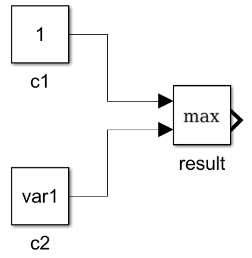

# Getting started

## Installation

The automatic layout feature relies on [GraphViz](https://www.graphviz.org/), which you need to install separately.

1. Install [GraphViz](https://www.graphviz.org/download/) and add it to the system PATH
2. Download and extract the Matsim package (from [File Exhange](https://it.mathworks.com/matlabcentral/fileexchange/68436-matsim) or from [Github](https://github.com/gave92/Matsim/archive/master.zip))
3. Add Matsim folder (and subfolders) to the Matlab path
4. Import Matsim package with 'import matsim.library.*'

## Concepts

### Block creation
In Matsim each simulink block is wrapped in a Matlab class. Every time you create an instance of a class, the corresponding simulink block is added to the model.

For example, if you write:
```matlab
c = Constant(1);
```
a simulink **Constant** block is added to the model.

All Matsim classes derive from the base **block** class, so you can also write:
```matlab
c = block('model','simulink','type','Constant');
set(c,'Value','1')
```
where the **'model'** and **'type'** parameters specify what kind of simulink block to create (i.e. the block named 'Constant' from the model library 'simulink'). This is more verbose but allows you a greater flexibility.

For many of the most common simulink blocks, Matsim provides a tailored wrapper class as a shortcut to easily create that kind of block. For example the **FromWorkspace** class constructor accepts a parameter that sets the blocks 'VariableName' parameter.
```matlab
fw = FromWorkspace('var1');
```
In plain simulink API this would be equivalent to:
```matlab
fw = add_block('simulink/Sources/From Workspace','my_model/From Workspace');
set_param(fw,'VariableName','var1')
```

All standard simulink block properties are still available when using Matsim. So to change the block color you would do:
```matlab
fw = FromWorkspace('var1');
set(fw,'ForegroundColor','red');
```
Or directly:
```matlab
fw = FromWorkspace('var1','ForegroundColor','red');
```

### Block connection
In Matsim it's very easy to quickly connect blocks. When you create a new block, you can also specify the inputs to that block.

<table>
<tr style="background: none;">
<td>
<pre class="  language-matlab"><code class="  language-matlab"><span class="token comment">% Create 2 Constant blocks</span>
c1 <span class="token operator">=</span> <span class="token function">Constant</span><span class="token punctuation">(</span><span class="token number">1</span><span class="token punctuation">,</span><span class="token string">'name'</span><span class="token punctuation">,</span><span class="token string">'c1'</span><span class="token punctuation">)</span><span class="token punctuation">;</span>
c2 <span class="token operator">=</span> <span class="token function">Constant</span><span class="token punctuation">(</span><span class="token string">'var1'</span><span class="token punctuation">,</span><span class="token string">'name'</span><span class="token punctuation">,</span><span class="token string">'c2'</span><span class="token punctuation">)</span><span class="token punctuation">;</span>

<span class="token comment">% Create a Max block with c1 and c2 as inputs</span>
res <span class="token operator">=</span> <span class="token function">Max</span><span class="token punctuation">(</span>c1<span class="token punctuation">,</span>c2<span class="token punctuation">,</span><span class="token string">'name'</span><span class="token punctuation">,</span><span class="token string">'result'</span><span class="token punctuation">)</span><span class="token punctuation">;</span></code></pre>
</td>
<td><pre style="font-size: 48px;">&nbsp;&#8594;&nbsp;</pre></td>
<td><pre>

</pre></td>
</table>

A block can become an input for the next.

<table>
<tr style="background: none;">
<td>
<pre class="  language-matlab"><code class="  language-matlab"><span class="token function">Scope</span><span class="token punctuation">(</span><span class="token function">Gain</span><span class="token punctuation">(</span><span class="token function">FromWorkspace</span><span class="token punctuation">(</span><span class="token string">'var'</span><span class="token punctuation">)</span><span class="token punctuation">,</span><span class="token string">'value'</span><span class="token punctuation">,</span><span class="token number">0.5</span><span class="token punctuation">)</span><span class="token punctuation">)</span></code></pre>
</td>
<td><pre style="font-size: 48px;">&nbsp;&#8594;&nbsp;</pre></td>
<td><pre>

</pre></td>
</tr>
</table>

Matsim translates common operations to equivalent simulink blocks. So you can "Add (+)", "Subtract (-)", "Multiply (.*)", "Concatenate ([])", ... blocks, and Matsim will generate the equivalent model. "a+b" will be translated as an "Add" block, "[a,b]" as a Mux block and so on.

<table>
<tr style="background: none;">
<td>
<pre class="  language-matlab"><code class="  language-matlab"><span class="token comment">% Create 3 From Workspace blocks</span>
u1 <span class="token operator">=</span> <span class="token function">FromWorkspace</span><span class="token punctuation">(</span><span class="token string">'u1'</span><span class="token punctuation">)</span><span class="token punctuation">;</span>
u2 <span class="token operator">=</span> <span class="token function">FromWorkspace</span><span class="token punctuation">(</span><span class="token string">'u2'</span><span class="token punctuation">)</span><span class="token punctuation">;</span>
u3 <span class="token operator">=</span> <span class="token function">FromWorkspace</span><span class="token punctuation">(</span><span class="token string">'u3'</span><span class="token punctuation">)</span><span class="token punctuation">;</span>

<span class="token comment">% Complex mathematical expression</span>
res <span class="token operator">=</span> <span class="token number">1</span> <span class="token operator">-</span> u1<span class="token operator">./</span><span class="token punctuation">(</span>u2<span class="token operator">.*</span>u3<span class="token punctuation">)</span></code></pre>
</td>
<td><pre style="font-size: 48px;">&nbsp;&#8594;&nbsp;</pre></td>
<td><pre>

</pre></td>
</tr>
</table>

### Model layout
With Matsim there's no need to specify the blocks positions on the simulink model! Matsim uses GraphViz to automatically generate a block layout. To position and connect the blocks already in the model, call `simlayout()`:

```matlab
sys = load_system('my_model');
...
% Create blocks
...
% Connect and layout the model
sys.layout()
```

## Examples

Quick example to get started. For more check the [tests](https://github.com/gave92/Matsim/tree/master/tests) folder.

#### 1. Create or load a simulink model

```matlab
import matsim.library.*                       % Import Matsim package

sys = simulation.load('my_model');            % Create or load a model named 'my_model'
sys.setSolver('Ts',0.01,'DiscreteOnly',true)  % Set solver for the model
sys.clear()                                   % Delete all blocks
sys.show()                                    % Show the model
```

#### 2. Create blocks

```matlab
Vx = FromWorkspace('V_x');                    % Add FromWorkspace and Constant blocks
Wr = FromWorkspace('W_r');
Rr = Constant(0.32);

slip = 1 - Vx./(Wr.*Rr);                      % Evaluate complex mathematical expression
sys.log(slip,'slip')                          % Log the output of the "slip" block

s = Scope(slip);                              % Create and open scope block
s.open()
```

#### 3. Connect and layout the model

```matlab
sys.layout()                         % Connect and layout the model
```
